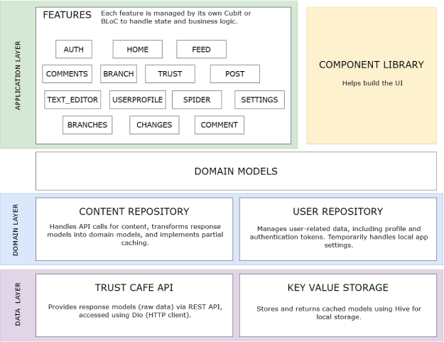
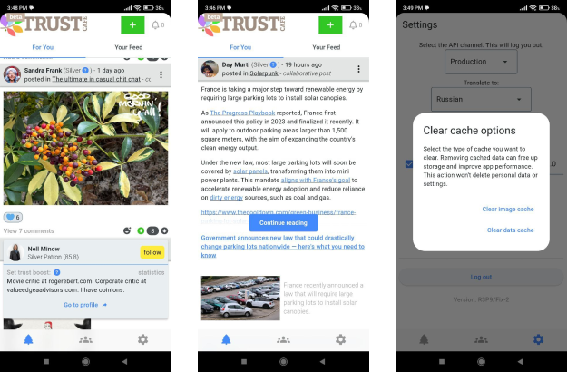

# Trust Cafe Mobile (TCM) Client

## Overview
Trust Cafe Mobile is a Flutter-based mobile client for the [Trust Cafe](https://www.trustcafe.io/en) platform, an aspiring social media network created to combat misinformation and foster community-led moderation. Dedicated to supporting meaningful discussions in a non-toxic, fact-based environment, this app was voluntarily developed to enhance user accessibility while introducing unique features not available on the website.

## Architecture breakdown
The app relies on several internal packages. Their purposes are illustrated in this diagram, along with the architecture breakdown.

## Future Goals
- Expand app functionality to match or exceed the web platform.
- Set up the CI/CD pipeline
- Write more automated tests
- Release on popular distribution platforms, such as the App Store and Google Play

## Installation
1. Download the `.apk` file from the [cloud storage](https://1drv.ms/f/c/d6077cbe9fc3c5f6/EgqwRJfIUBRDpWanXhcfSUMBUH4KgHOv9ILeHDQR_FTAZw?e=lf4J88).
2. Follow the installation instructions for Android devices.

## Screenshots
